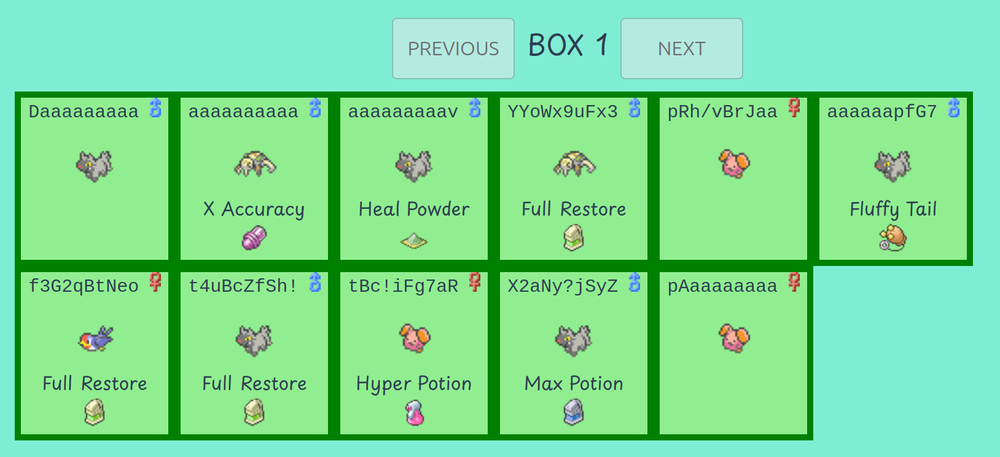
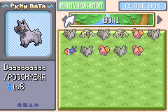

# MON File System (MON-FS)

## What is this

Have you ever wanted to use your Pokemon Emerald PC to store a tiny amount of data at incredibly slow and inconvenient read and write speeds?

Well look no further!

This is an encoding system that allows you to encode arbitrary data as pokemon!

take `my_message.txt` containing `Nintendo 3DS is better than the switch.` it encodes to below.



And looks like this in game.



## How to use it

### Encoding

#### Getting the PC.json file

The `pc.json` file is a guide to what your PC should look like in emerald to encode the data.

##### Web

You can go to this site https://sardap.github.io/mon-fs/ which let's you load files and it uses a WASM build of the rust code to generate and visualize the `pc.json` file.

##### CLI

You can use the `mon-fs` CLI tool with the following command.

`mon-fs encode --to-encode ./test_assets/ricky.webp`

This will generate a `pc.json` the the same folder you run it in.

#### Populating the data in Emerald

Once you have a `pc.json` file you can write the data to emerald.

##### Do it yourself

the `pc.json` file is human readable so you could just read it. It's a much better idea to upload it to the site https://sardap.github.io/mon-fs/ and tick them off.

##### pokebot-gen3

I'm going to be real with you this is janky as fuck (The pokebot is great my parts are janky).

1. Get all the items listed in the `pc.json` you need manually.
2. Buy a metric fuck ton of pokeballs. I think pokeballs are the most cost efficient but they take longer. this table is probably wrong.

```
Ball        Cost Per 10 Poo CPC	    Taillow CPC ACPC
Repeat Ball 10000	    1000        1274.50	    1137.25
Ultra ball	12000	    1529.40     1922.33	    1725.87
Poke ball	1800	    534.20      643.47	    588.84
Great Ball	6000	    1193.22     1464.91	    1329.06
Nest ball	10000	    1000        1000.06	    1000.03
```

3. Go to a grass patch on route 116
4. Turn on the `mon-fs: Spin` mode. This mode will run until all data mons have been caught.
5. After all have been caught go to a PC and open someone's PC menu.
6. Turn on the `mon-fs: Sort PC`.
7. After this is done go to the PLAYER_NAME's PC and open the withdraw items menu.
8. Turn on the `mon-fs: Grab required items from pc`.
9. After this is done go back to the someone's PC menu.
10. Turn on the `mon-fs: give items to box-mons`.
11. Keep looping over steps 8, 9. until it no longer grabs items from the PC.
12. Go to the someone's PC menu if you see the `mon-fs: screenshot option` it means the write was successful! don't forget to save.

### Decoding

#### Do it yourself

The site https://sardap.github.io/mon-fs/ has a decode mode where you can enter all the attributes about the pokemon and it spits out a file.

#### CLI tool

You need to have poetry installed to run the OCR program.

You need to provide a folder of screenshots of each data mon in the move pokemon view. they must be ordered the same as the pokemon.

You can use the `mon-fs: screenshot` mode to make this easy.

Run the following command

```
mon-fs decode --decode-to PATH_TO_WRITE_FILES --pc-screenshots SCREENSHOT_FOLDER --python-script-path ./pc_screenshot_decoder
```

This should read the screenshots and write the file(s) to the given path.
