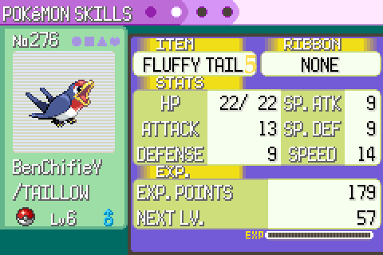

# MON File System (MON-FS)

## What is this

Video on the subject https://www.youtube.com/watch?v=DvCXC-uQSik

Have you ever wanted to use your Pokemon Emerald PC to store a tiny amount of data at incredibly slow and inconvenient read and write speeds?

Well look no further!

This is an encoding system that allows you to encode arbitrary data as pokemon!

take `my_message.txt` containing `Nintendo 3DS is better than the switch.` it encodes to below.


And looks like this in game.


## How to use it

### Encoding

#### Getting the PC.json file

The `pc.json` file is a guide to what your PC should look like in emerald to encode the data.

##### Web

You can go to this site https://sardap.github.io/mon-fs/ which let's you load files and it uses a WASM build of the rust code to generate and visualize the `pc.json` file.

##### CLI

You can use the `mon-fs` CLI tool with the following command.

`mon-fs encode --to-encode ./test_assets/ricky.webp`

This will generate a `pc.json` the the same folder you run it in.

#### Populating the data in Emerald

Once you have a `pc.json` file you can write the data to emerald.

##### Do it yourself

the `pc.json` file is human readable so you could just read it. It's a much better idea to upload it to the site https://sardap.github.io/mon-fs/ and tick them off.

##### pokebot-gen3

I'm going to be real with you this is janky as fuck (The pokebot is great my parts are janky).

1. Get all the items listed in the `pc.json` you need manually.
2. Buy a metric fuck ton of pokeballs. I think pokeballs are the most cost efficient but they take longer. this table is probably wrong.

```
Ball        Cost Per 10 Poo CPC	    Taillow CPC ACPC
Repeat Ball 10000	    1000        1274.50	    1137.25
Ultra ball	12000	    1529.40     1922.33	    1725.87
Poke ball	1800	    534.20      643.47	    588.84
Great Ball	6000	    1193.22     1464.91	    1329.06
Nest ball	10000	    1000        1000.06	    1000.03
```

3. Go to a grass patch on route 116
4. Turn on the `mon-fs: Spin` mode. This mode will run until all data mons have been caught.
5. After all have been caught go to a PC and open someone's PC menu.
6. Turn on the `mon-fs: Sort PC`.
7. After this is done go to the PLAYER_NAME's PC and open the withdraw items menu.
8. Turn on the `mon-fs: Grab required items from pc`.
9. After this is done go back to the someone's PC menu.
10. Turn on the `mon-fs: give items to box-mons`.
11. Keep looping over steps 8, 9. until it no longer grabs items from the PC.
12. Go to the someone's PC menu if you see the `mon-fs: screenshot option` it means the write was successful! don't forget to save.

### Decoding

#### Do it yourself

The site https://sardap.github.io/mon-fs/ has a decode mode where you can enter all the attributes about the pokemon and it spits out a file.

#### CLI tool

You need to have poetry installed to run the OCR program.

You need to provide a folder of screenshots of each data mon in the move pokemon view. they must be ordered the same as the pokemon.

You can use the `mon-fs: screenshot` mode to make this easy.

Run the following command

```
mon-fs decode --decode-to PATH_TO_WRITE_FILES --pc-screenshots SCREENSHOT_FOLDER --python-script-path ./pc_screenshot_decoder
```

This should read the screenshots and write the file(s) to the given path.

## Technical breakdown

Self imposed limitations

1. All data used should be human visible.
   - No using hidden IV's or anything like that.
2. A human should be able to write at least basic files.
3. No hacking or glitching should be required to get the needed items or mons.

### Encoding data into a Pokemon

Selecting the fields to use.

#### Fields not even worth considering

Nature: Since this is only human visible after catching it's just not worth it for the 4 bits.

Shininess: In gen 3 pokemon have a 0.012207031% of being shiny for a single bit that's not worth it.

Ribbon: This shows the number of ribbons there are 27 ribbons but all are fairly involved. This would only give us at most 4 bits for an insanely high effort. Even just if we make it >= 1 ribbon is 1 and none is 0 it's still just not worth it.

#### Fields worth considering

Here are the screens we can refer to gather data for the mons.

<p align="center">
  
  <br>
  <em>PC Move Hover</em>
</p>

<p align="center">
  
  <br>
  <em>PC Summary screen 1</em>
</p>

<p align="center">
  
  <br>
  <em>PC Summary screen 2</em>
</p>

<p align="center">
  
  <br>
  <em>PC Summary screen 3</em>
</p>

##### 1. Species - 4 bits

Visible on: Everything

This is the most complicated field since it has the most potential options on the surface.

There are 386 pokemon in gen 3 wow that's 8 bits.

But only 202 are obtainable in the emerald that drops it 7 bits.

But then we have single catch pokemon (Rayqauza, etc) or we need to get from eggs (which would be a massive time sink) or Feebass. that leaves us with 132 pokemon 7 bits we can found out in the wild.

But also that's not even feasible some pokemon are stupid hard to find looking at you Seedot and that stupid flying bug in a tux. Jumping between routes will make it harder for a human or a bot to get all the needed pokemon.

Route 116 is the ideal route because it is the <ins>only</ins> route with 4 different kinds of pokemon at encounter rates of over 20% giving us 2 bits.

ROUTE 116
| Species | Probability | Gender Ratio | Levels |
| ------------- | ------------- | ------------- | ------------- |
| POOCHYENA | 28% | 50/50 | 6,7,8 |
| WHISMUR | 20% | 50/50 | 6 |
| SKITTY | 2% | Doesn't matter | Doesn't matter |
| ABRA | 10% | Doesn't matter | Doesn't matter |
| TAILLOW | 20% | 50/50 | 6,7,8 |
| NINCADA | 20% | 50/50 | 6,7 |

The only other candidate would be victory road 1F since it has 8 species at over 5%. giving us 3 bits.

VICTORY ROAD 1F
| Species | Probability | Gender Ratio | Levels |
| ------- | ----------- | ------------ | ------ |
| MAKUHITA | 10% | 75/25 | 36 |
| LOUDRED | 10% | 50/50 | 40 |
| WHISMUR | 5% | 50/50 | 36 |
| LAIRON | 10% | 50/50 | 40 |
| ZUBAT | 10% | 50/50 | 36 |
| ARON | 5% | 50/50 | 36 |
| HARIYAMA | 25% | 75/25 | 38,40 |
| GOLBAT | 25% | 50/50 | 38,40 |

However when we take into account the bit we can get from gender we can get 3 bits from route 116 since each of the target mons have a gender ratio of 50/50 that means the worst encounter rate will be 10% (0.2 \* 0.5) twice that of the worst encounter rate at Victory road.

If we use gender for Victory road 1F grouping our worst encounter rate will be 2.5% thats simply too shit.

It makes the choice of using the four pokemon POOCHYENA, NINCADA, WHISMUR and TAILLOW clear.

##### 2. Name - 60 bits

Visible on: PC move hover, All Mon summary screens

This is the easiest we have over 64 and less than 128 possible characters in english emerald giving us a cool 6 bits per character. This let's me dyslexic proof it to make it easier for me to use. These are the letters I opted for "aAbBcCdDeEfFgGhHiIjJkKmMnNoOpPqQrRsStTuUvVwWxXyYzZ23456789!?/-…♂♀". I also opted to exclude spaces to make it easier to know exactly what letters in the name and prevent miscounting spaces or something else.

##### 3. Level - Not worth it

Visible on: PC move hover, All Mon summary screens

Level is a difficult one since there are two methods of getting pokemon at a level training and catching.

Catching at a level: on route 116 WHISMUR is only available at level 6 kill any possibility for the catching route. Additionally the probability is different for example it's only 4% to to find a level 8 POOCHYENA.

Training: This seems great they are all at least level 6 with some light elbow greese or a lot of rare candies from pickup.

Take this level table assuming 6 is our base since all pokemon on route 116 we care about can be found at level 6.
| Level Range | bits | Max candies required |
| ----------- | ---- | -------------------- |
| 6 - 10 | 2 | 4 |
| 6 - 14 | 3 | 8 |
| 6 - 22 | 4 | 16 |
| 6 - 38 | 5 | 32 |

This seems good but with the max slots of 420 pokemon even needing 420 rare candies would be an effort let alone a safe 840 estimate. Not to mention applying the rare candies.

##### 4. Gender - 1 bit

Visible on: PC move hover, All Mon summary screens

Out of the pokemon on route 116 all can ether be male or female 2 makes it an easy 1 bit.

##### 5. Held Item - 5 bits

Visible on: PC move hover, Mon summary screen 2

There are 377 items in the game data but less than 64 can be purchased at stores. You could use berries or pickup but they both require a lot more time than just grinding out the elite four with an amulet coin.

That leaves us with 32 fairly cheap items you can purchase and gives us 5 bits.

##### 6. PC Mark - 4 bits UNUSED

Visible on: PC move hover, Mon summary screen 2

Mark is just four bits that you can set in the PC on a pokemon.

This is just really perfect i'm annoyed I missed it.

<p align="center">
  
  <br />
  <em>How did I miss this?</em>
</p>

**Unused** since I missed it no good reason.

##### 7. Caught ball - 3 bits UNUSED

Visible on: All Mon summary screens

There are 12 poke balls in emerald however

- The Master ball is single use.
- Safari Balls can't be used on route 116.
- Luxury Balls are a pain in the ass.

Leaving us with 9 ball kinds we can drop the Premium Ball and get a cool 3 bits

**Unused** Due to cost of balls you already need well over 100 balls typically to account for failures it didn't seem worth it. However after PC mark this is the next easiest thing to pick up 3 bits.

##### 8. Moves 1 bit - UNUSED

Visible on: Mon Summary screen 3

The move sets for all the route 116 pokemon on catch are

| Pokemon   | Moves                                      | HM Moves   |
| --------- | ------------------------------------------ | ---------- |
| POOCHYENA | TACKLE, HOWL                               | Rock Smash |
| NINCADA   | SCRATCH, HARDEN, LEECH_LIFE                | None       |
| WHISMUR   | POUND, UPROAR                              | None       |
| TAILLOW   | PECK, GROWL, FOCUS_ENERGY, QUICK_ATTACK(8) | Fly        |

You could create a mapping so each different kind of mon can have at least one more bit.

| Pokemon   | Mapping      | Bit |
| --------- | ------------ | --- |
| POOCHYENA | Tackle, Howl | 0   |
| POOCHYENA | Howl, Tackle | 1   |

etc.

Unfortunately the HM selection is lacking not allowing us to fill out all mons to a full four moves giving us 2 bits.

**Unused** at 1 bit this isn't worth the effort.

Maybe another route shows more promise?

#### Fields used for the pokemon

Out of the 8 somewhat viable fields available I selected

- Species - 2 bits
- Name - 60 bits
- Gender - 1 bit
- Item Held - 5 bits

This leaves us with 68 bits per pokemon.

#### Encoding data into the PC

Unfortunately we can't use every slot in the PC.

Since the smallest block size is 68 bits we will end up needing to pad out the final mon.

Not to mention 68 % 8 != 0 so we will always be leaving at least 4 bits on the table if the PC is full.

The first mon in the PC contains the number of padding bits in the final mon in the PC.

This leaves us with (419 \* 68) - 4 = 28488 usable bits or 3.561KB.

**With easy expansions** With the easy expansion of mark and ball type it could be increased to (419 \* 75) - 3 = 31422 usable bits brining it up to 3.927KB.

### Decoding data from the PC

The difficulty in decoding comes from reading the data. We can't just directly read from the game because where is the sport in that?

Using OpenCV to read the screenshots is very straight forward split up the sprite sheet for the fonts into pngs. Then use those images as templates.

Then slice up the screenshots into the field sections. Template match on the expected font do some basic sanity checks and your golden.

We now have all the fields in a nice json that can be parsed and turned into the rust enums that can be mapped back into a bit vector which can be turned into a byte array.
